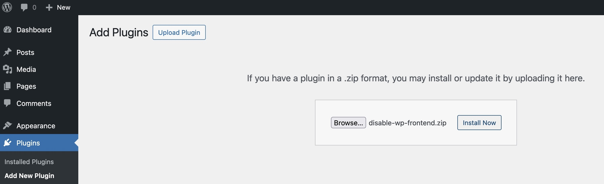
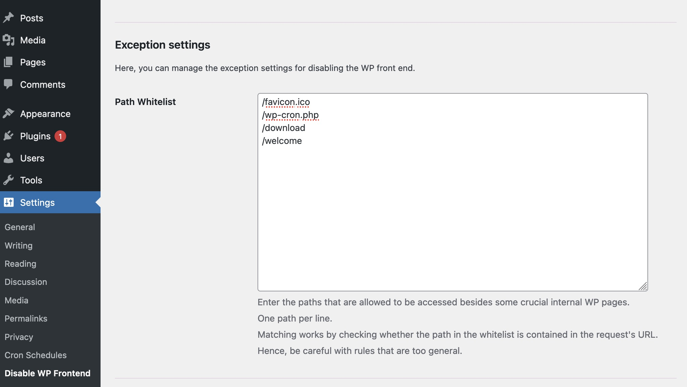
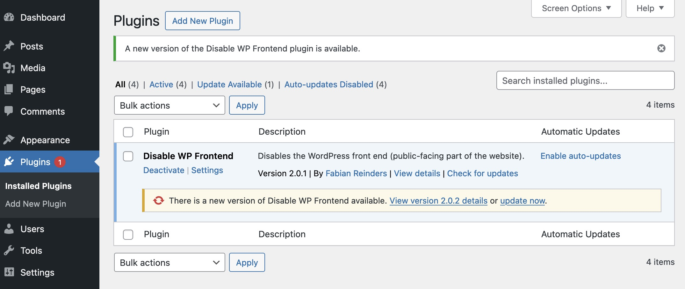

   <h1>Disable WP Frontend</h1>

   <b>A simple, lightweight WordPress plugin to disable the WordPress front end in headless environments.</b>

---

## Table of Contents

* [Installation](#installation)
* [Excluding URLs](#excluding-urls)
* [Upgrading to a new version](#upgrading-to-a-new-version)
* [Credits](#credits)

## Installation

1. Download the `disable-wp-frontend.zip` file from
   the [latest release](https://github.com/fabiancdng/disable-wp-frontend/releases/latest).
2. In your WordPress admin panel, navigate to `Plugins -> Add New`.
3. Click `Upload Plugin` at the top of the page.
4. Upload the `disable-wp-frontend.zip` file.
5. Activate the plugin.

## Excluding URLs

Sometimes you might want to allow access to certain URLs in WordPress.

That's why there is a path whitelist in the plugin's options allowing you to exclude certain URLs from being blocked.

You can find and edit the whitelist on the WordPress admin panel under `Settings -> Disable WP Frontend`.

## Upgrading to a new version

Upgrading to a new version can be done entirely from within the WordPress admin panel. No need to upload a new zip file!

The plugin will automatically check for updates twice a day.

If you want to check for updates manually, you can click
the `Check for updates` button on the plugin's settings page.

## Credits

"Disable WP Frontend" uses the following third-party open-source libraries and packages:

* [`plugin-update-checker`](https://github.com/YahnisElsts/plugin-update-checker) by Yahnis Elsts
